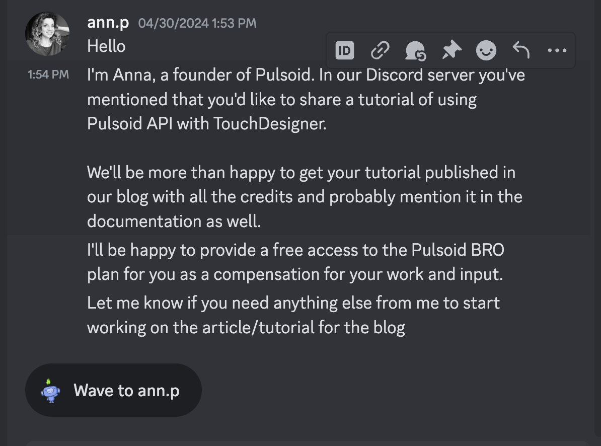

<!--
Type of the contribution should be "Wikipedia edit", "OpenStreet Map feature", "Documentation", "Course website", "Blog",
"Browser Add-on", etc.

The description should include a brief summary of what you did.

The link should bring us to a public page that shows your contribution. 

Replace the first row with your own contribution. 

-->

| Date #       | Contribution (Link)  | Type  | Description |
|---|:---|:---|:---|
|Feb 10 - April 20 | [link to my contribution](https://github.com/rajsodhinyu/deltaskins/blob/main/PinkWithJoystick/iphone_edgetoedge_portrait.pdf)    | [Delta for iPhone](https://github.com/rileytestut/Delta)|   Created and coded a DS skin for the DS emulator app that uses a joystick instead of D-Pad. Highly requested! Used Illustrator, Photoshop, and `.json`.|
|March 10|[link](https://github.com/rajsodhinyu/pulsoid)|Requested Discord Feature/Issue|Integrating a heartbeat app with popular audio-visual-design software TouchDesigner using HTTP. Used at NYU Tisch!|

|March 20|Not published|Pulsoid/Documentation|Founder reached out to me personally after my PR to ask me to join the documentation team(!) No response until April 30|

|April 21 |[link](https://github.com/delta-skins/delta-skins.github.io/pull/13)|[Delta Skins](https://delta-skins.github.io/)|Adding my own skin to the website, making sure the skin passes compliance, etc. This one was merged, making my skin the first to be endorsed since the App Store launch! |
|April 22|[Compression Wording (MERGED!)](https://github.com/noah978/Delta-Docs/pull/9)|Documentation Update|After helping so many people in the Discord compress the files inside the folder instead of a folder with the files, I PRed a documentation update that would clarify. Repo seems slightly dead but I did reach out to Noah and ask. He merged it, and said 'Happy NYU is contributing to OSS'. Huge win, given that this is the number one free app in the Apple App Store.|
|April 28|[link](https://github.com/aphaits/Deltaskin-Template)|Skin template for newcomers|In collaboration with a Discord user, making a skin template system so designers have a place to start.|

|April 29|[link](https://github.com/aphaits/Deltaskin-Template)|Skin template for newcomers|Furthering the skin template system with pre-built `.json` files so designers don't need to code to make a skin.|

|April 30|Unpublished yet|Formal offer to write blog|
|

